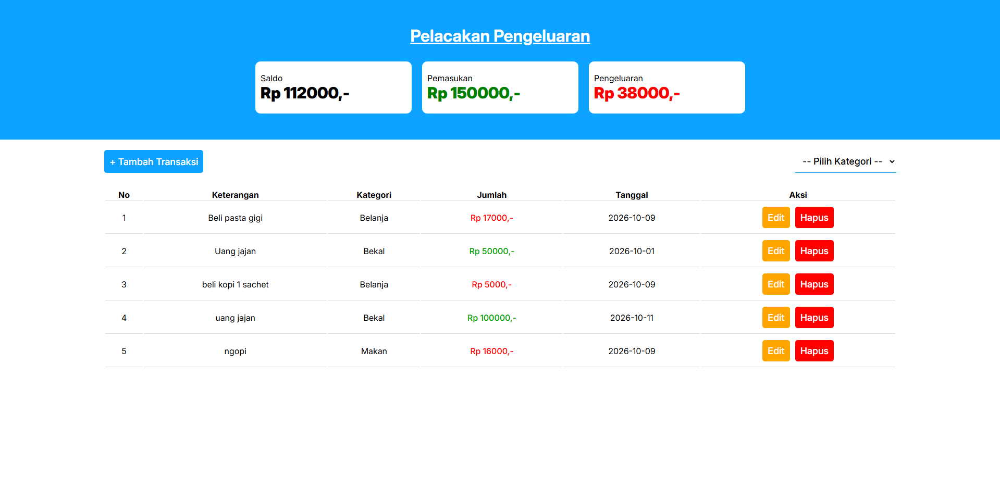

# Pelacakan Pengeluaran
Website tentang pencatatan pengeluaran sederhana menggunakan React + Vite.

# Fitur
1. Melakukan CRUD (Create, Read, Update, Delete).
2. Menggunakan localStorage sebagai database sederhana.
3. Menyediakan fitur berdasarkan kategori.
4. Perhitungan otomatis untuk saldo terkini baik yang total, masuk, ataupun keluar.

# Install

Install dependencies: `pnpm install`

run: `pnpm run dev`

# Screenshots

